# Window Size 24 (1 day)
Test MSE: 0.19212552905082703
Test MAE: 0.3283980190753937
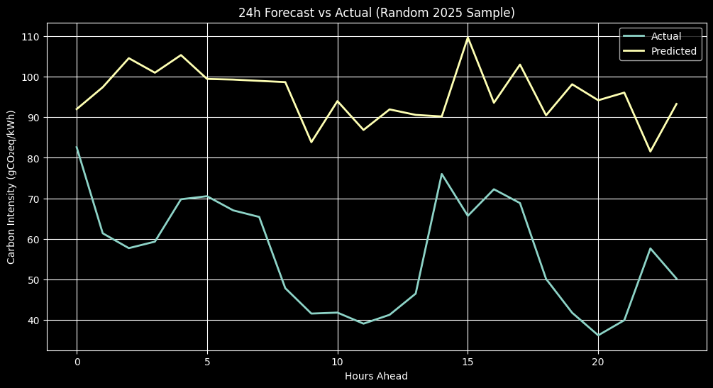
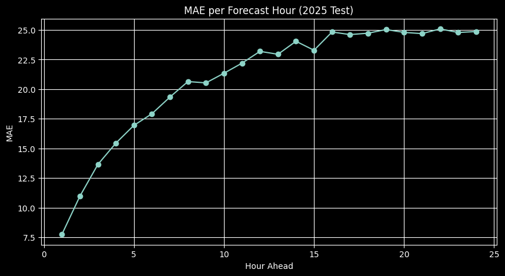
Summer MAE: 15.755492529727986
Winter MAE: 25.555028637045563

# Window Size 72 (3 days)
Test MSE: 0.1924109011888504
Test MAE: 0.32998889684677124
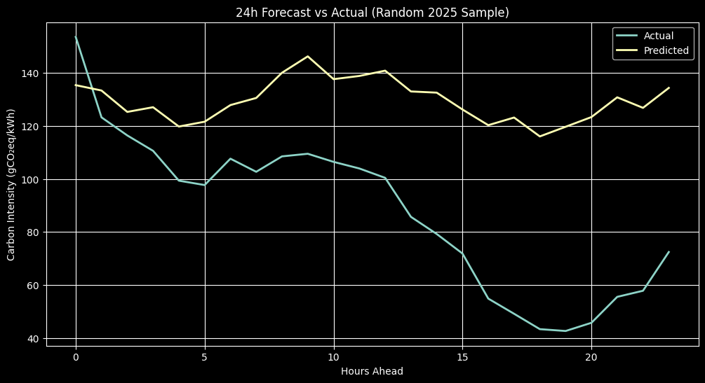
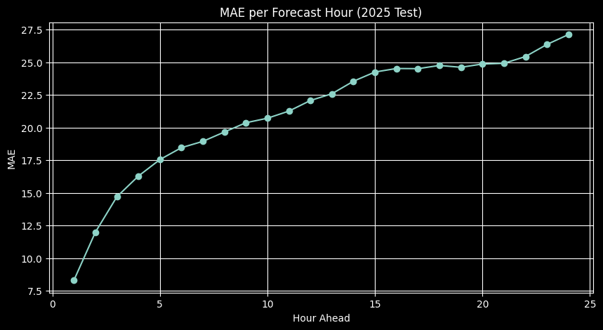
Summer MAE: 16.549646557658768
Winter MAE: 24.933099126378384

# Window Size 168 (1 week)
Test MSE: 0.1817009150981903
Test MAE: 0.32139334082603455
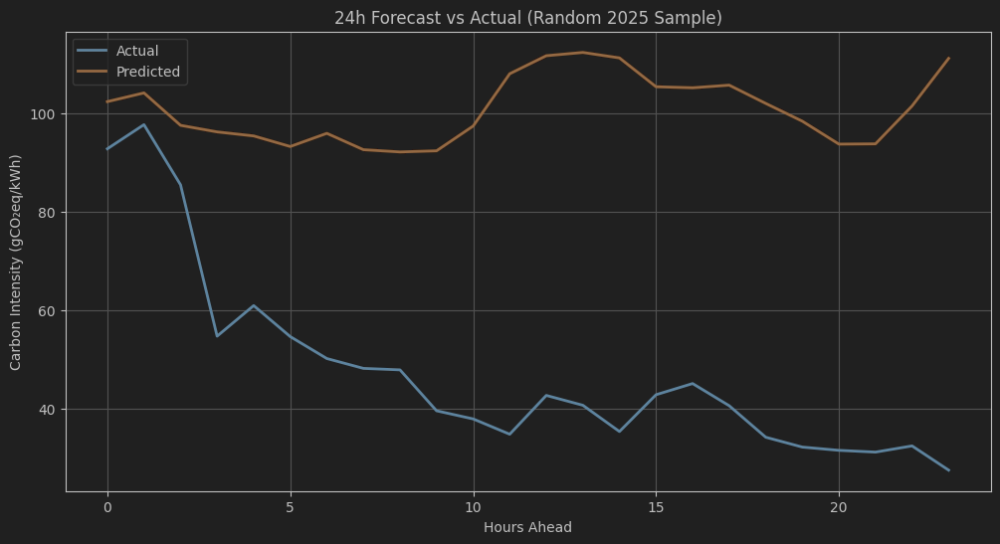
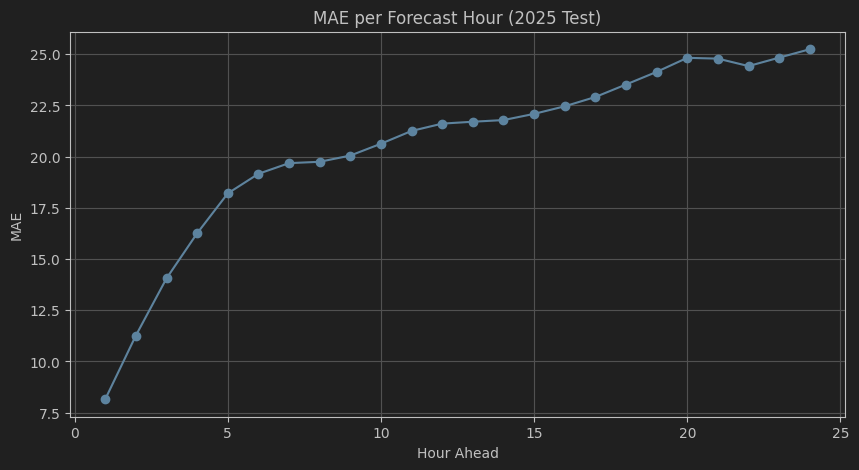
Summer MAE: 15.228532819408148
Winter MAE: 24.823551842200406

# Window Size 336 (2 weeks)
Test MSE: 0.170777827501297
Test MAE: 0.30654171109199524
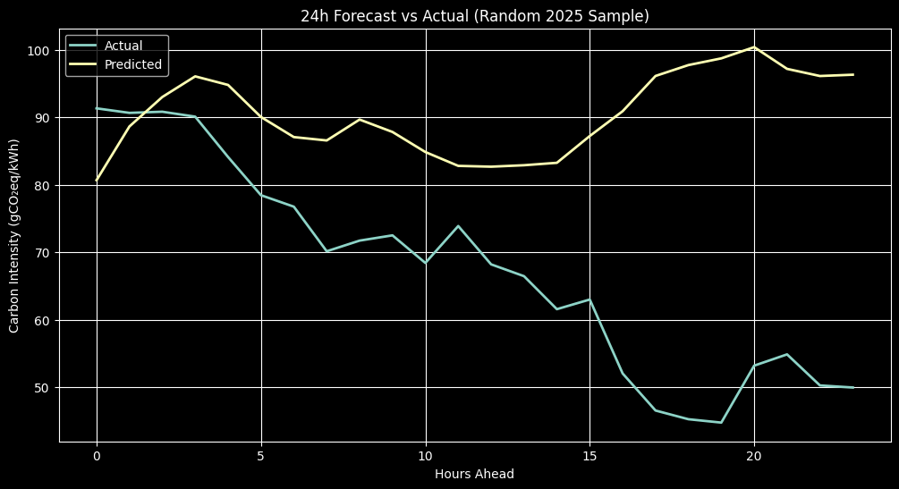
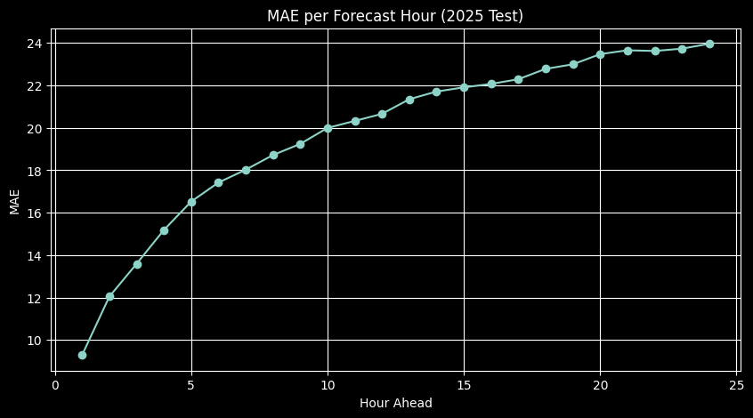
Summer MAE: 14.739000543574779
Winter MAE: 23.67467929049598

# Window Size 504 (3 weeks)
Test MSE: 0.1748443841934204
Test MAE: 0.3114001750946045
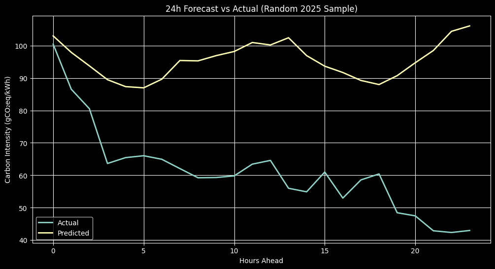
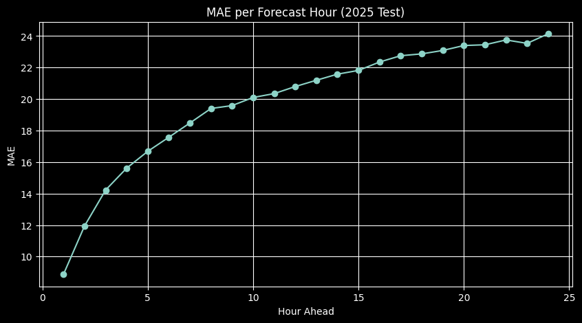
Summer MAE: 14.99296082739093
Winter MAE: 23.64338334399111
# Window Size 672 (4 weeks)
Test MSE: 0.17589229345321655
Test MAE: 0.3145638108253479
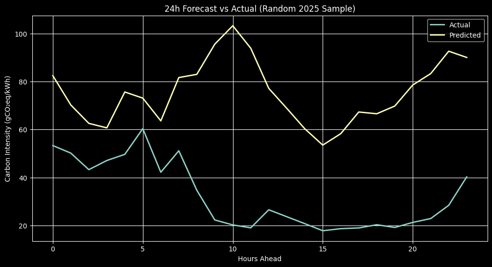
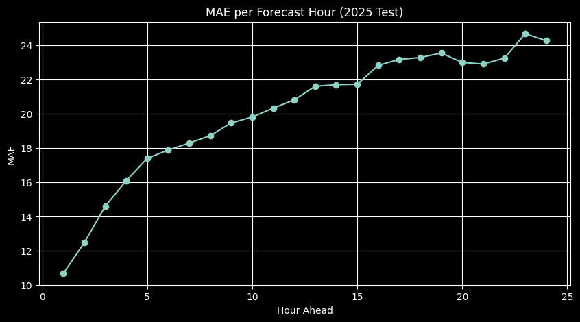
Summer MAE: 14.970797085566222
Winter MAE: 23.8680780426748